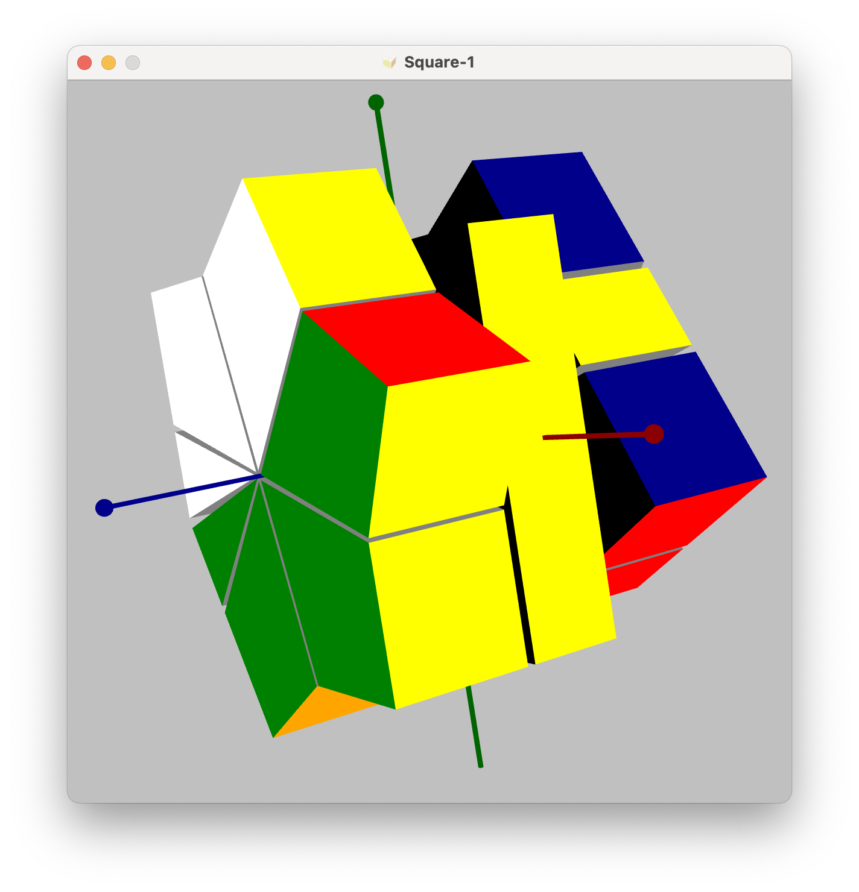
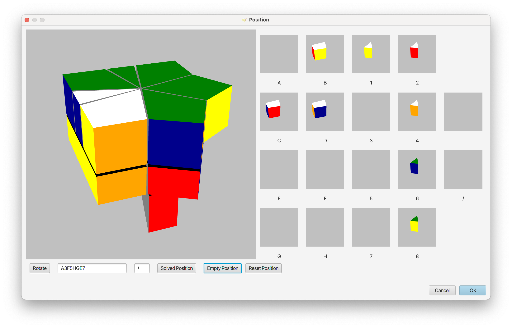
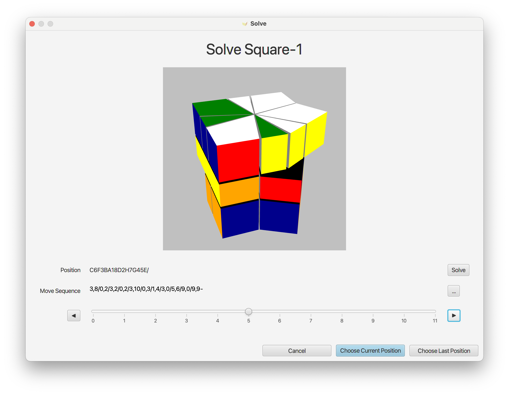

# Square-1

Welcome to this small project to visualize and solve the Square-1 puzzle with JavaFX.

See this [Wikipedia article](https://en.wikipedia.org/wiki/Square-1_%28puzzle%29) for a description of Square-1 cube.

# Pieces

The Square-1 is built from different pieces:

+ 8 Corner pieces
+ 8 Edge pieces
+ 2 Middle pieces

# Usage

This application allows viewing and editing Square-1 positions as well as solving a mixed Square-1. 

You can use the mouse to rotate the Square-1 cube and see all sides and you can enable the three coordinate axis. Keyboard keys can be used to control different rotations as well.

Via the position dialog you can enter the pieces and the position of your mixed Square-1.

A solve dialog is provided that helps you to solve a mixed Square-1 and get step by step instruction to bring your Square-1 back into the solved state.

User help can be opened by menu or by hot key explaining all aspects when using of this application.

Enjoy ...

# Releases

Releases can be found 

# Further Information

If you would like to learn more about Square-1 puzzle and how to solve it take a look to these links

* The [Wikipedia article](https://en.wikipedia.org/wiki/Square-1_%28puzzle%29) about Square-1
* Square-1 on [Jaap's excellent puzzle page](https://www.jaapsch.net/puzzles/square1.htm)
* More details about the internal structure and pieces of Square-1 [here](internals.md) in this project
* Jaap has created a description of solving algorithms [here](https://www.jaapsch.net/puzzles/compcube.htm)
* [Jaap's solver](https://github.com/mikavilpas/squanmate/tree/master/resources/public/jaap-square1-solver) as standalone program (also available on his puzzle page)
* Details of the [implementation with JavaFX](implementation.md)
