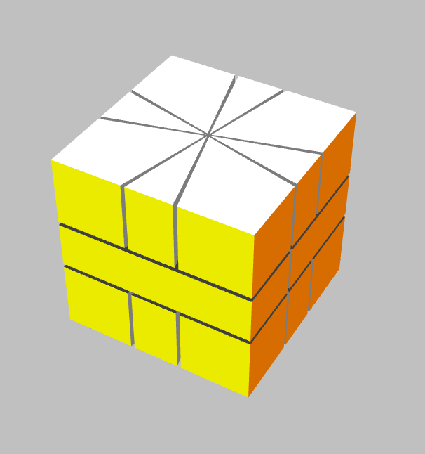
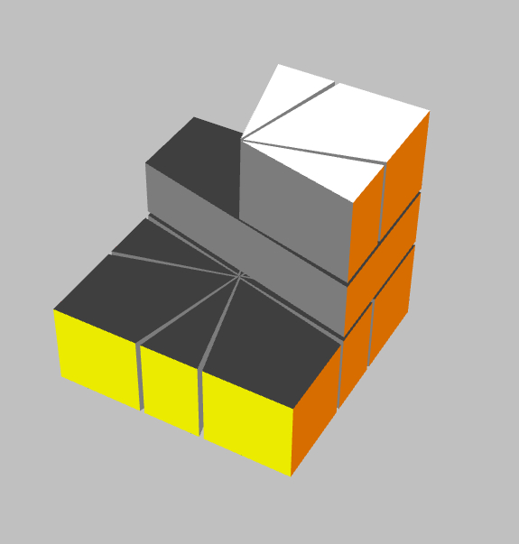
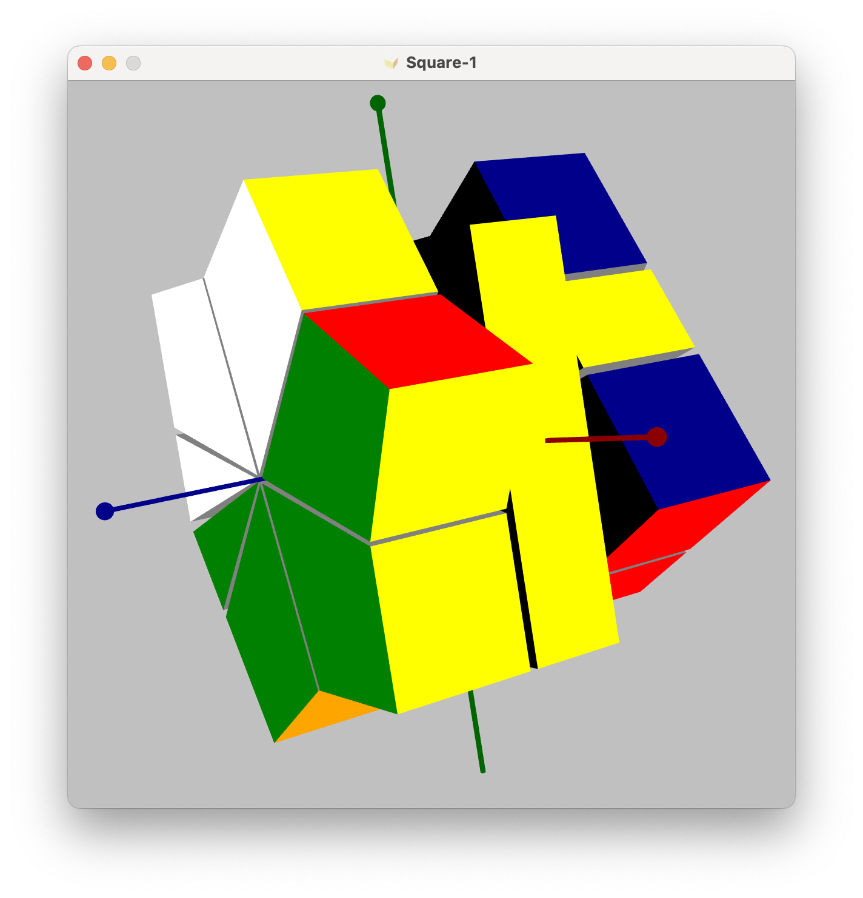
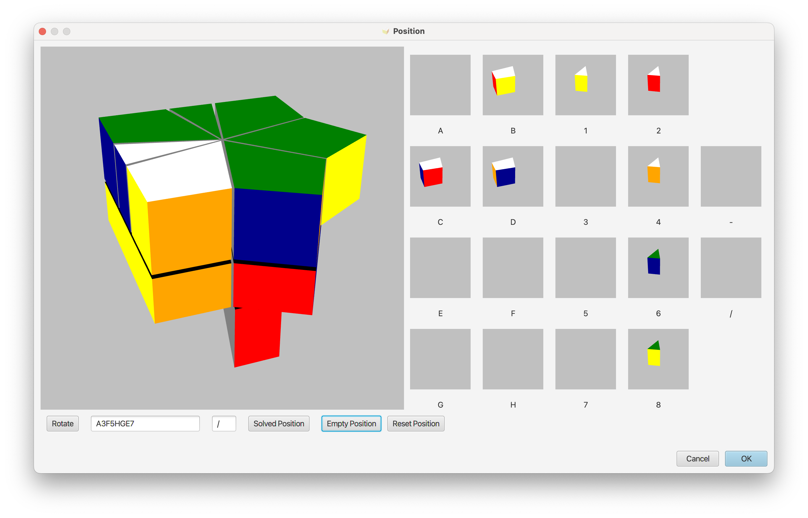
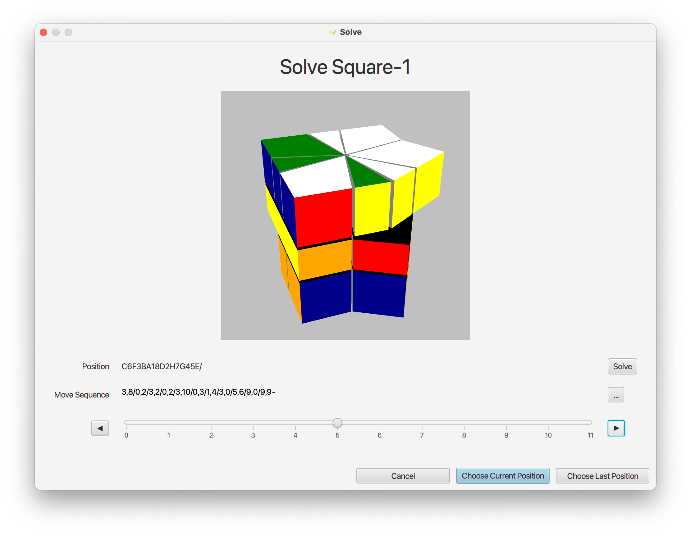

# Square-1

Welcome to this small project to visualize and solve the Square-1 puzzle with JavaFX.



See this [Wikipedia article](https://en.wikipedia.org/wiki/Square-1_%28puzzle%29) for a description of Square-1 cube.

# Pieces

The Square-1 is built from different pieces:

+ 8 Corner pieces
+ 8 Edge pieces
+ 2 Middle pieces



# Usage

This application allows viewing and editing Square-1 positions as well as solving a mixed Square-1. 

You can use the mouse to rotate the Square-1 cube and see all sides and you can enable the three coordinate axis. Keyboard keys can be used to control different rotations as well.




Via the position dialog you can enter the pieces and the position of your mixed Square-1.




A solve dialog is provided that helps you to solve a mixed Square-1 and get step by step instruction to bring your Square-1 back into the solved state.



User help can be opened by menu or by hot key explaining all aspects when using of this application.

Enjoy ...

# Releases

Releases can be found [](https://github.com/treimers/square-1/releases/latest)

> [!WARNING]
> The application is not signed with an Apple or Microsoft developer certificate. macOS and Windows can refuse to start a copy downloaded from GitHub. Have a look to the next section what must be done if you are facing this situation.

## macOS

Open the downloaded disk image (`.dmg`) and copy `Square-1.app` into the Applications folder. On an Apple Silicon Mac use the `macos-arm64` build. On an Intel Mac use the `macos-x86_64` build.

If macOS reports that `Square-1.app` cannot be opened, Control-click the application in Finder and choose **Open**. In the following dialog, click **Open** again.

If that dialog does not offer **Open**, open **System Settings**, go to **Privacy & Security**, and allow Square-1 with **Open Anyway**.

You can also clear the download attributes in Terminal:

```
xattr -cr /Applications/Square-1.app/
```

## Windows

In Explorer, right-click the downloaded installer (`.exe`) and choose **Properties**. On the **General** tab, the **Security** section at the bottom says that the file came from another computer and access may have been blocked. Select **Unblock**, then **Apply**.

If Windows SmartScreen shows **Windows protected your PC**, choose **More info** and then **Run anyway**.

# Further Information

If you would like to learn more about Square-1 puzzle and how to solve it take a look to these links

* The [Wikipedia article](https://en.wikipedia.org/wiki/Square-1_%28puzzle%29) about Square-1
* Square-1 on [Jaap's excellent puzzle page](https://www.jaapsch.net/puzzles/square1.htm)
* More details about the internal structure and pieces of Square-1 [here](internals.md) in this project
* Jaap has created a description of solving algorithms [here](https://www.jaapsch.net/puzzles/compcube.htm)
* [Jaap's solver](https://github.com/mikavilpas/squanmate/tree/master/resources/public/jaap-square1-solver) as standalone program (also available on his puzzle page)
* Details of the [implementation with JavaFX](implementation.md)
