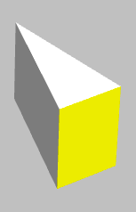
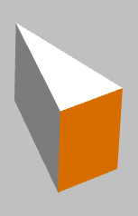
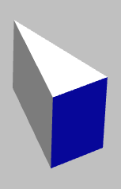
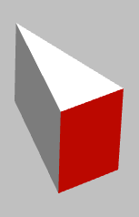
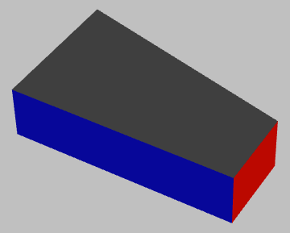

# Square-1

Small project for visualization of Square-1 puzzle in JavaFX.

 

Images from Wikipedia: https://en.wikipedia.org/wiki/Square-1_(puzzle)

# Pieces

The Square-1 is built from different pieces

+ Corners pieces
+ Edges pieces
+ Middle pieces

## Corner piece

A corner piece has six sides: top, left rear, left front, right rear, right front, bottom. Only three of them are colored. In order to model a corner piece in JavaFX 3D the eight points A to H are used:

There are 8 corner pieces used in a Square-1 cube.

## Edge piece

An edge piece has five sides: top, left, front, right, bottom. In order to model an edge piece in JavaFX 3D the six points A to F are used:

There are 8 edge pieces used in a Square-1 cube.

## Middle piece

An middle piece has six sides: top, left, front, right, rear, bottom. In order to model a middle piece in JavaFX 3D the eight points A to H are used:

There are 2 middle pieces used in a Square-1 cube.

# Usage

Currently the application supports viewing only. You can use the mouse to rotate the Square-1 cube and see all sides.

Keyboard keys can be used to toggle visibility of the pieces and do rotations:

+ Keys A - H: toggle visibility of a corner (named from A=1 to H=8)
+ Keys 1 - 8: toggle visibility of an edge (numbered from 1 to 8)
+ Keys M - N: toggle visibility of a middle piece (M = middle piece 1, N = middle piece 2)
+ Keys X: toggle visibility of x-axis, y-axis and z-axis
+ Key 0: hide all nodes (edges, corners and middle pieces)
+ Key 9: show all nodes (edges, corners and middle pieces)
+ Key Z: rotate in positive direction along z-axis (not possible with mouse)
+ Key Y: rotate in negative direction along z-axis (not possible with mouse)

