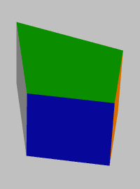
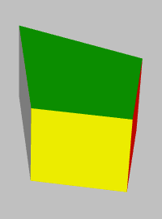
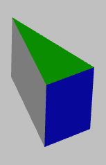

# Square-1

Small project for visualization of Square-1 puzzle in JavaFX.

See this [Wikipedia article](https://en.wikipedia.org/wiki/Square-1_%28puzzle%29) for a description of Square-1 cube.

# Pieces

The Square-1 is built from different pieces:

+ 8 Corner pieces
+ 8 Edge pieces
+ 2 Middle pieces

## Corner piece

There are 8 corner pieces used in a Square-1 cube. A corner piece has six sides: top, left rear, left front, right front, right rear, bottom.  Three of them are colored.

| Type   | Orientation | Name | Colors | Image |
|--------|-------------|------|--------|-------|
| Corner Piece | Top         | A    | White, Yellow, Orange |  |
| Corner Piece | Top         | B    | White, Red, Yellow |  |
| Corner Piece | Top         | C    | White, Blue, Red |  |
| Corner Piece | Top         | D    | White, Orange, Blue |  |
| Corner Piece | Bottom      | E    | Green, Blue, Orange |  |
| Corner Piece | Bottom      | F    | Green, Red, Blue |  |
| Corner Piece | Bottom      | G    | Green, Yellow, Red |  |
| Corner Piece | Bottom      | H    | Green, Orange, Yellow |  |

## Edge piece

There are 8 edge pieces used in a Square-1 cube. An edge piece has five sides: top, left, front, right, bottom. Two of them are colored.

| Type   | Orientation | Name | Colors | Image |
|--------|-------------|------|--------|-------|
| Edge Piece   | Top         | 1    | White, Yellow |  |
| Edge Piece   | Top         | 2    | White, Red | |
| Edge Piece   | Top         | 3    | White, Blue | |
| Edge Piece   | Top         | 4    | White, Orange | |
| Edge Piece   | Bottom      | 5    | Green, Orange | |
| Edge Piece   | Bottom      | 6    | Green, Blue | |
| Edge Piece   | Bottom      | 7    | Green, Red | |
| Edge Piece   | Bottom      | 8    | Green, Yellow | |

## Middle piece

There are 2 middle pieces used in a Square-1 cube. A middle piece has six sides: top, left, front, right, rear, bottom. Three of them are colored.

| Type   | Name | Colors | Image |
|--------|------|--------|-------|
| Middle Piece     | M | Red, Orange, Yellow |  |
| Middle Piece     | N | Orange, Blue, Red |  |

# Releases

Releases can be found [here for download](https://github.com/treimers/square-1/releases/latest).

# Usage

This application allows viewing and editing Square-1 positions currently. Solving the Square-1 is coming next. 

You can use the mouse to rotate the Square-1 cube and see all sides. Keyboard keys can be used to control different rotations as well.

User help is available from menu or by hot key.

Enjoy ...
