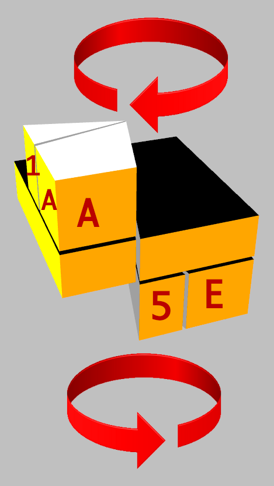

# Notation

Jaap Scherphuis introduced two notations, the first one to model a Square-1 position and and the second one for moves.

## Notation for Positions

A Square-1 consists of 8 corner pieces, 8 edge pieces and 2 middle pieces. All corner pieces are named by letters from 'A' to 'H', all edge pieces are named by digits from '1' to '8'.

The middle layer has two pieces with possible positions:

 - the middle layer is in original state (square) or
 - the middle layer is twisted (kite-shape).

An original middle layer is reflected in this notation by a '-' character while a twisted middle layer is identified by a '/' character.

Hold the Square-1 so that one of the longer sides of the middle layer is on the left side. You should see a gap in the front with a smaller rectangle to the left and a longer rectangle to the right.

The pieces in the top layer are now counted starting from the position left to this gap. Subsequent pieces are ordered clockwise (from top view). On a solved Square-1 the top layer is denoted by A1B2C3D4.

The pieces in the bottom layer are counted starting from the position right to the gap. Next pieces are arranged clockwise (from bottom view). The bottom layer of a solved Square-1 consist of pieces 5E6F7G8H.

The starting piece positions at top and bottom layer are illustrated in the next picture:

Putting this all together gives the position string with top layer pieces, bottom layer pieces and middle layer position. This results in

	A1B2C3D45E6F7G8H-

for a solved Square-1.

A Square-1 with a twisted middle layer is represented by this position string

	A1B2C3D45E6F7G8H/

## Notation for Moves

A move consists of three parts

- a top layer turn
- a bottom layer turn and
- a twist move.

Consider the following sequence for a move

- (3,4)/

The '3' means turn top layer 3 units, the '4' means turn the bottom layer 4 units and the '/' indicates do a twist turn of the right half of the cube around the middle axis.

A unit is the angle a small edge piece spans or 30°. Possible values for the top and bottom turns are 0 to 11. Also negative numbers are common in this notation so the move

- (9,11)/

is equivalent to

- (-3,-1)/

The move direction is the same we already saw in the position notation. See the red arrows in the position image above.

If no twist turn is required we use a '-' instead of '/' like in

- (3,0)-

Also note that the parenthesis can be omitted giving a shorter form of the move notation

- 3,8/0,2/3,2-