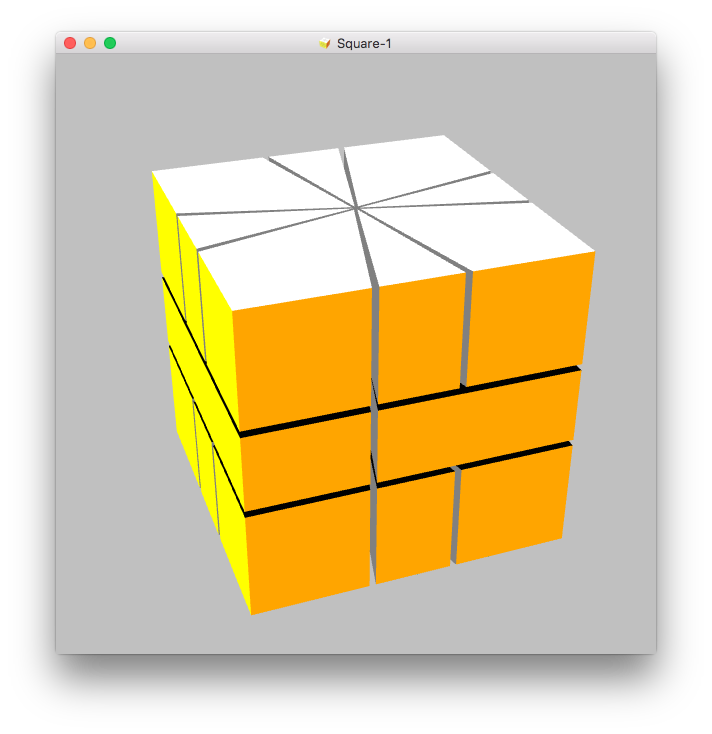

# Getting started

After first application start a solved Square-1 is presented.

It might be that your Square-1 model is using different colors than this visualization. You can adjust the colors to your Square-1 cube, please have a look to colors chapter for a detailed description.

There are several options available to rotate the Square-1 using the mouse, the menus or hot keys. Chapter Rotation will explain all options.

And finally go to the position menu under Square-1 menu. With this you can enter a scrambled position of the Square-1 with drag and drop or using the Jaap's position notation. Go to chapter positions explaining the options for that.