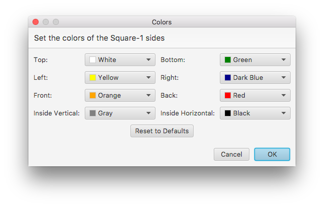
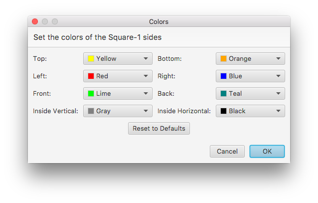
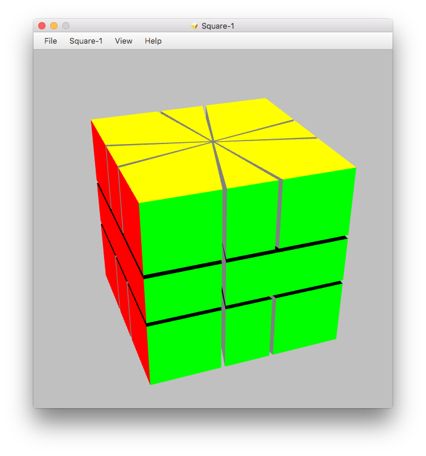

# Color Schemes

Colors of the Square-1 are set according to the coloring scheme of the original Square-1. You can define you own coloring scheme to reflect appearance of your Square-1 you got from a different manufacturer.

Select "Colors..." from the Square-1 menu in order to adjust the color scheme to your needs. A dialog will pop up showing the standard color scheme:

You can change the colors of the 6 outer sides as well as the colors of the inner sides:

After clicking the Ok button the Square-1 will be re-colored using your selection:

A "Reset to Defaults" button is also available allowing you to revert the coloring scheme to that of a original Square-1.
