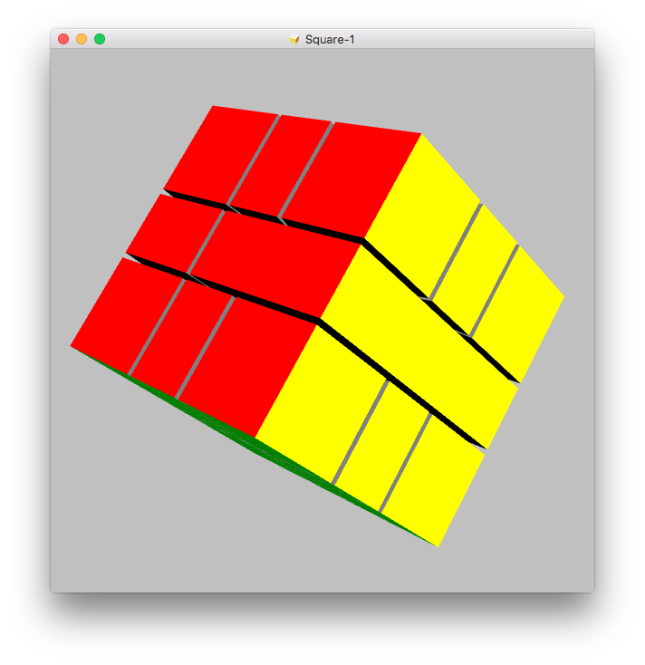

# Rotation

There are different options to use rotations and see other sides. First of all you can use the mouse. Click on the cube, hold down the mouse button and move the mouse. The Square-1 will rotate around x- and y-axis according to your movement.

Also you can use the rotate menu. Open the menu and try the sub menus. Note that there is a 360° animation menu that you can use to run an animated rotation of the Square-1. Also you can reset all rotations you have made to get back to the original position.

And there is a radio menu entry by that you can display or hide the axis. The x-axis is colored red, the y-axis has green color while the z-axis is blue.

