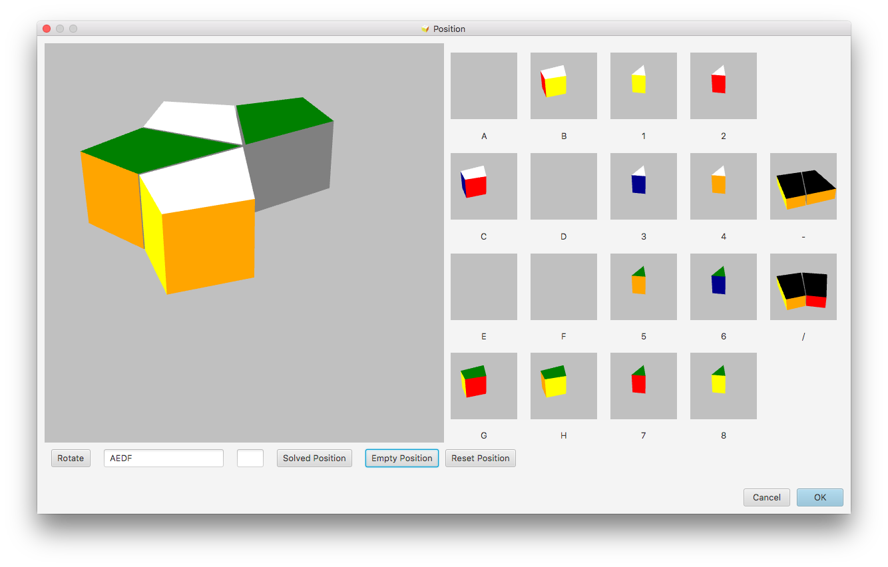

# Enter Position

Via the Position menu a new position can be defined. After start the position dialog displays the current position:

A new position can be defined after a click on the "Empty Position" button. All pieces will be removed from the Square-1 panel and appear in the small panels on the right side.

Drag and drop the pieces from the right panels to the view panel on the left. They will be added to the Square-1 and disappear on the right.

You can consecutively add all pieces using drag and drop until the scrambled Square-1 is completed. Filling will take place according to the notation beginning with position one in the top layer.

The middle position can be selected and added at any time during this process.

Note that there are text fields available in the bottom left of this dialog for the position. You can also enter pieces using their name by hitting the corresponding character on your keyboard. Also you can remove pieces via these fields with the delete key.

Helper buttons to rotate the Square-1 and all pieces or to return to the solved position, the empty position or the last position are available as well.