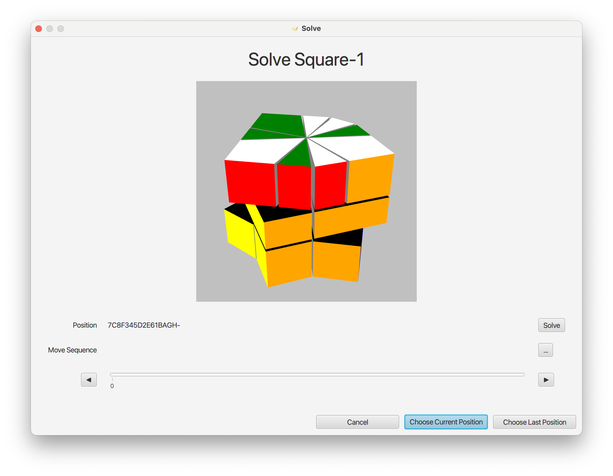
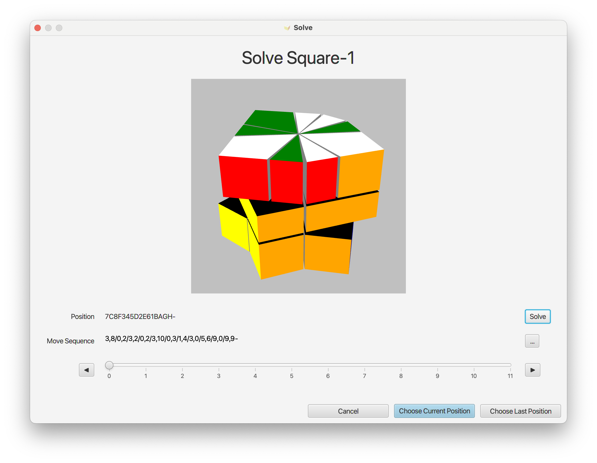
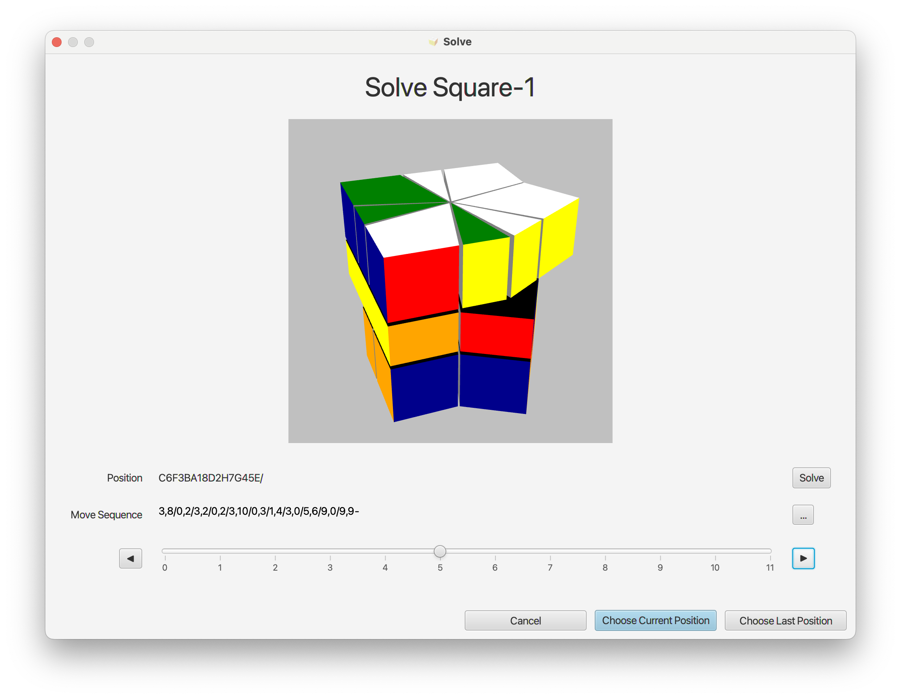
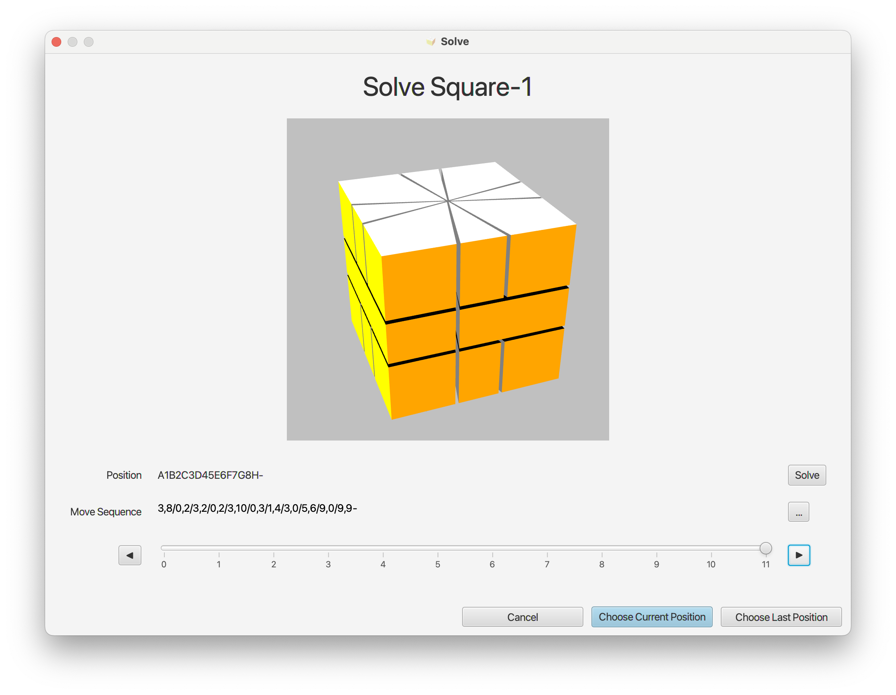

# Solve Position

A given position can be solved by entering the solve dialog.

This will show the current position of your Square-1. You can click on the solve button in the right and the program will try to find the moves required to bring your Square-1 back to solved state.

Note the "Move Sequence" and the slider that appear in the bottom of the dialog after the position has been solved. 

The move sequence will show the correct moves with top layer move, bottom layer move and twist move leading to the solved Square-1.

Find the explanation of the move notation in the [notation chapter](1_2_notation.html#moves). 

You can move the slider with the mouse or by clicking on the left and right arrows in order to watch how the given moves will lead to the solved position when applied step by step.

Moving the slider to the last position should show the solved Square-1.

You can choose which position should be applied to the displayed Square-1 by either clicking on "Choose Current Position" or "Choose Last Position". The solve dialog will be closed and the Square-1 will be 